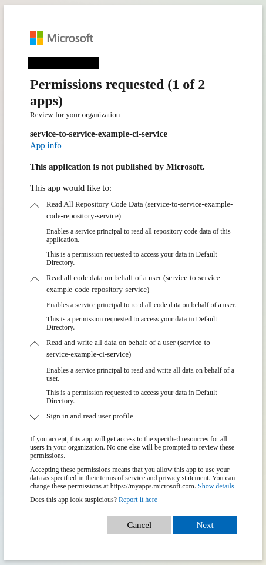

# Entra ID service to service communication example

This repository provides an example how to implement service to service communication between custom services.

## How to execute the example

1. Create a `config.sh` file, similar to the `config.example.sh`.
2. Execute the `setup_and_start.sh` in the root directory.
    * Provisions example App registrations via terraform in target Entra ID directory
    * Creates `appsettings.Compose.json` in `apps/CiService` and `apps/CodeRepositoryService` for docker-compose environment
    * Creates `appsettings.Development.json` in `apps/CiService` and `apps/CodeRepositoryService` for local debugging
    * Starts a swagger-ui on http://localhost:8080
    * Builds and starts CiService and CodeRepositoryService in docker-compose environment
    * Keeps running and prints logs of `swagger-ui`, `ci-service` and `code-repository-service`

## Example scenario

1. Open swagger-ui in browser on http://localhost:8080

### Create Code Repository with code

1. Select `CodeRepository` definition (should be the default)
2. Authorize for `code-repository-service` Enterprise application
    1. Click `Authorize` button to open `Available authorizations` dialog
    2. Scroll to `UserAuthentication` form
    3. Select `{app-id}/.default` scope.
    4. Copy `{app-id}` into the `client_id` field
    5. Click `Authorize` on `Available authorizations` dialog
    6. Accept consent form for `code-repository-service` application
        * 
    7. Click `Close` on `Available authorizations` dialog
3. Create `test` repository
    1. Click `Try it out` on `POST /repositories`
    2. Enter `test` as `repositoryName`
    3. Click `Execute` button
4. Inspect logs of `code-repository-service-1` to see the Bearer token
    * Decode Bearer token. E.g. via https://jwt.io/
    * ```
      {
        "aud": "{CODE_REPOSITORY_CLIENT_ID}", // Audience: ID of the code repository server Enterprise Application. Other applications must not accept this token.
        "iss": "https://login.microsoftonline.com/{TENANT_ID}/v2.0", // Issuer: Authorization server which issued this token. Is trusted by the code repository server.
        "azp": "{CODE_REPOSITORY_CLIENT_ID}", // Authorized Party: ID of the code repository server Enterprise Application.
        "name": "{user_display_name}",
        "oid": "{user_principal_object_id_in_entra_id}",
        "preferred_username": "{preferred_username}",
        "scp": "UserImpersonation.ReadWrite.All", // Scopes: Token authorizes to perform read and write operations on behalf of the user. This scope is only valid for the specfic audience (in this case the code repository service)!
        "sub": "{application_scoped_user_id_string}",
        "tid": "{TENANT_ID}",
        [...]
      }
      ```
5. Create code resource via `PUT /repositories/{repositoryName}/code` endpoint for the `test` repository and with any content

### Create Job for test repository, authenticating to CodeRepositoryService via app token

1. Select `CiService` definition in swagger-ui
2. Authorize for `ci-service` Enterprise application
    1. Click `Authorize` button to open `Available authorizations` dialog
    2. Scroll to `UserAuthentication` form
    3. Select `{app-id}/.default` scope.
    4. Copy `{app-id}` into the `client_id` field
    5. Click `Authorize` on `Available authorizations` dialog
    6. Accept consent form for `ci-service` application
        * 
        * 
    7. Click `Close` on `Available authorizations` dialog
3. Create job for `test` repository with any command and with `impersonateUser=false`
4. Inspect logs of `ci-service-1` to see the Bearer token
    * Decode Bearer token. E.g. via https://jwt.io/
    * ```
      {
        "aud": "{CI_SERVICE_CLIENT_ID}", // Audience: ID of the ci service Enterprise Application. Other applications must not accept this token.
        "iss": "https://login.microsoftonline.com/{TENANT_ID}/v2.0", // Issuer: Authorization server which issued this token. Is trusted by the ci service.
        "azp": "{CI_SERVICE_CLIENT_ID}", // Authorized Party: ID of the ci service Enterprise Application.
        "name": "{user_display_name}",
        "oid": "{user_principal_object_id_in_entra_id}",
        "preferred_username": "{preferred_username}",
        "scp": "UserImpersonation.ReadWrite.All", // Scopes: Token authorizes to perform read and write operations on behalf of the user. This scope is only valid for the specfic audience (in this case the ci service)!
        "sub": "{application_scoped_user_id_string}",
        "tid": "{TENANT_ID}",
      }
      ```
5. Inspect logs of `code-repository-service-1` to see the Bearer token
    * Decode Bearer token. E.g. via https://jwt.io/
    * ```
      {
        "aud": "{CODE_REPOSITORY_CLIENT_ID}",  // Audience: ID of the code repository server Enterprise Application. Other applications must not accept this token.
        "iss": "https://login.microsoftonline.com/{TENANT_ID}/v2.0",
        "azp": "{CI_SERVICE_CLIENT_ID}", // Authorized Party: ID of the ci service Enterprise Application.
        "oid": "{ci_service_principal_object_id_in_entra_id}",
        "roles": [
          "Repositories.Code.Read.All" // ci-service has the code-repsitory-service app role "Repositories.Code.Read.All" assigned. Therefore it is allowed to read the repository code of any user.
        ],
        "sub": "{ci_service_principal_object_id_in_entra_id}",
        "tid": "{TENANT_ID}",
        [...]
      }
      ```

### Create Job for test repository, authenticating to CodeRepositoryService on-behalf of the user via a user token

1. Create job for `test` repository with any command and with `impersonateUser=true`
2. Inspect logs of `ci-service-1` to see the Bearer token
   * Should be still the same user token like before 
3. Inspect logs of `code-repository-service-1` to see the Bearer token
    * Decode Bearer token. E.g. via https://jwt.io/
    * ```
      {
        "aud": "{CODE_REPOSITORY_CLIENT_ID}",  // Audience: ID of the code repository server Enterprise Application. Other applications must not accept this token.
        "iss": "https://login.microsoftonline.com/{TENANT_ID}/v2.0",
        "azp": "{CI_SERVICE_CLIENT_ID}",  // Authorized Party: ID of the ci service Enterprise Application.
        "name": "{user_display_name}",
        "oid": "{user_principal_object_id_in_entra_id}",
        "preferred_username": "{preferred_username}",
        "scp": "UserImpersonation.Repositories.Code.Read.All", // Scopes: Token authorizes to read repository code on behalf of the user. This scope is only valid for the specfic audience (in this case the code repository service)!
        "sub": "{application_scoped_user_id_string}",
        "tid": "{TENANT_ID}",
        [...]
      }
      ```
